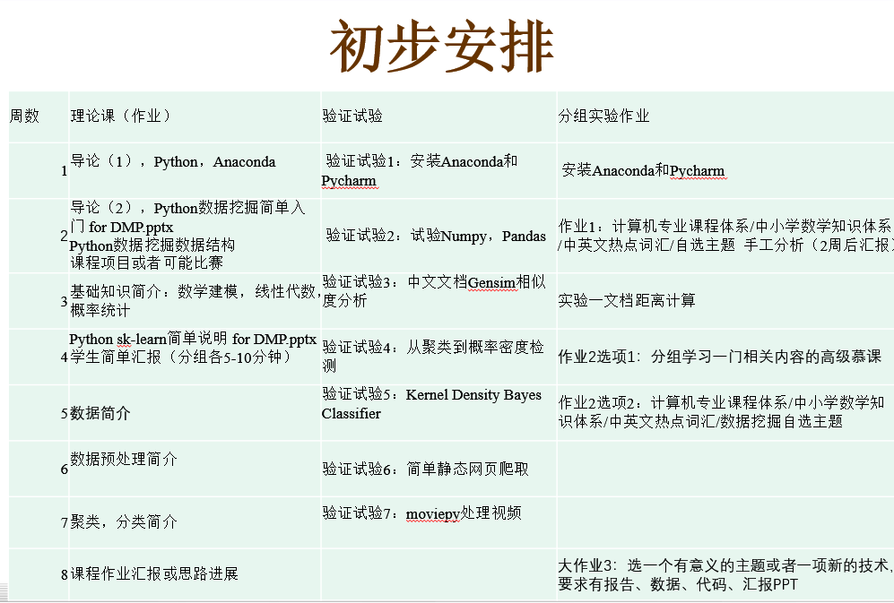
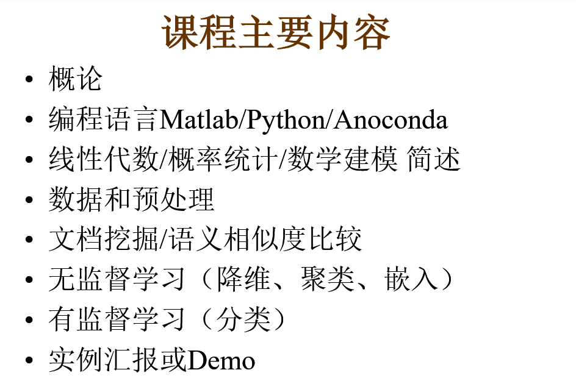
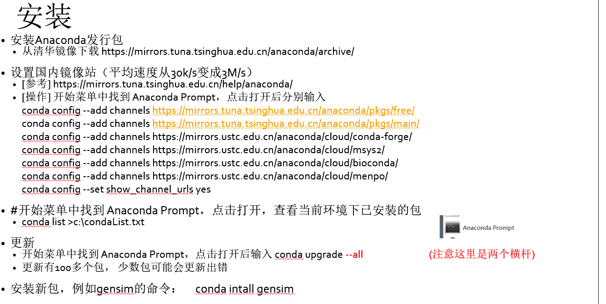
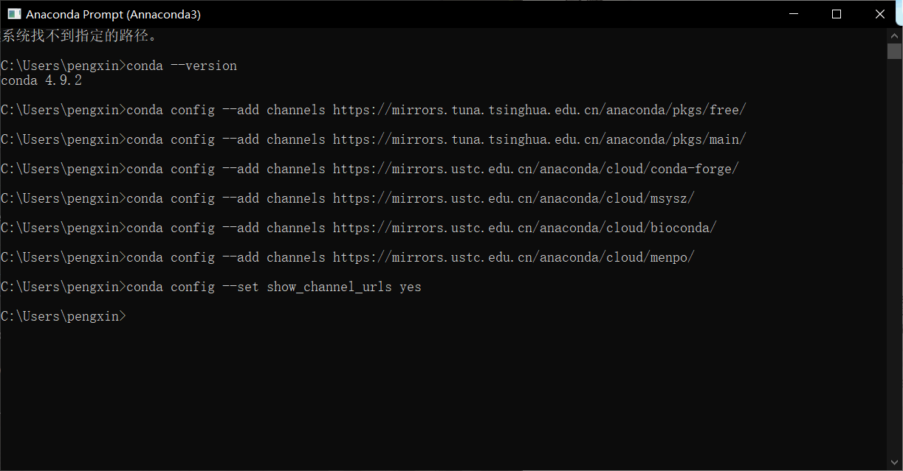
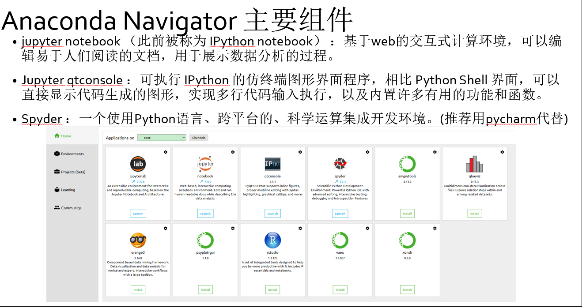

<!--
 * @Autor: violet apricity ( Zhuangpx )
 * @Date: 2022-02-23 20:45:15
 * @LastEditors: violet apricity ( Zhuangpx )
 * @LastEditTime: 2022-02-24 11:39:46
 * @FilePath: \GZHU-DataMining\README.md
 * @Description:  Zhuangpx : Violet && Apricity:/ The warmth of the sun in the winter /
-->
# GZHU-DataMining

广州大学数据挖掘课程学习记录及相关内容

## 简介

课程初步安排:



课程主要内容:



实验课内容:


## Python数据挖掘简单入门

- 准备

使用 `Anaconda` 包发行包全家桶，编程环境 `PyCharm`

版本:`Anaconda3-2020.11-Windows-x86_64.exe` 和 `pycharm-community-2020.3.3.exe`

推荐使用清华大学镜像网:<https://mirrors.tuna.tsinghua.edu.cn/help/anaconda/>

下载安装之后进行镜像设置:







> `Jupyter Notebook`（此前被称为 `IPython notebook` ）是一个交互式笔记本，支持运行 40 多种编程语言。

使用 `JupyterNotebook` 指定双击打开.ipynb 方法：


`bat`内容是`..\python.exe`+`..\cwp.py`+`..\`+`..\python.exe`+`Scripts\jupyter-notebook-script.py`+`"%USERPROFILE%/"`

把最后的`%USERPROFILE%`改成`%1%`即可

如:

```shell
D:\ALL_Project-DevelopTools\Anaconda\Annaconda3\python.exe D:\ALL_Project-DevelopTools\Anaconda\Annaconda3\cwp.py D:\ALL_Project-DevelopTools\Anaconda\Annaconda3 D:\ALL_Project-DevelopTools\Anaconda\Annaconda3\python.exe D:\ALL_Project-DevelopTools\Anaconda\Annaconda3\Scripts\jupyter-notebook-script.py "%1%/"
```

之后在对应代码块通过`Ctrl+enter`即可运行

参考:<https://www.jianshu.com/p/89999a6b2028>
